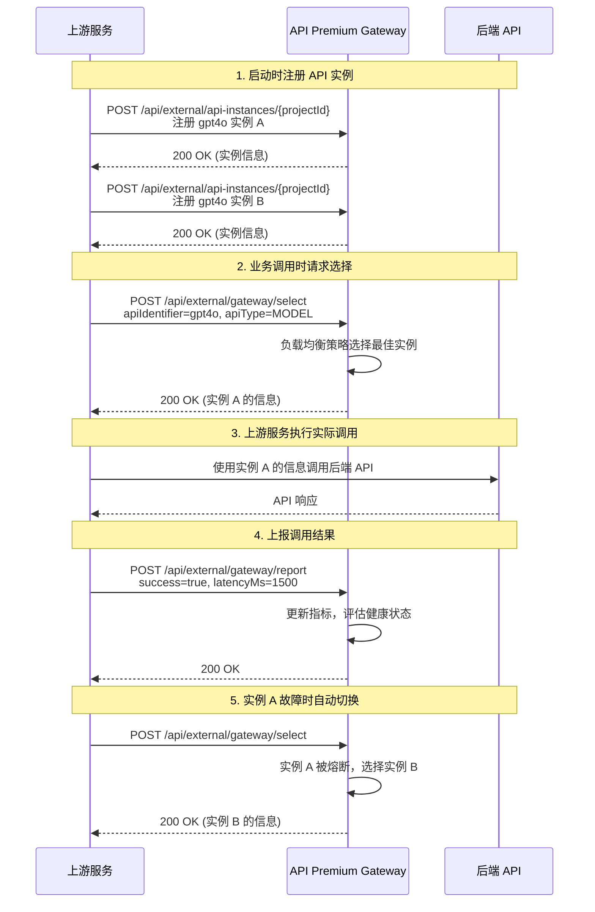

# API Premium Gateway — API 接口文档

> **Base URL**：`http://localhost:8081`  
> **协议**：HTTP/1.1  
> **数据格式**：JSON（`Content-Type: application/json`）  
> **字符编码**：UTF-8  
> **时间格式**：ISO 8601（`2006-01-02T15:04:05Z07:00`）  

---

## 1. 认证方式

所有标记为"需要认证"的接口，必须提供有效的 API Key。支持两种传递方式：

| 方式 | 格式 | 示例 |
|------|------|------|
| **请求头**（推荐） | `X-API-Key: <your-api-key>` | `X-API-Key: gw_default_key_for_development` |
| **查询参数** | `?apiKey=<your-api-key>` | `?apiKey=gw_default_key_for_development` |

**认证失败响应**：

```json
{
  "code": 500,
  "message": "缺少 API Key，请在请求头 X-API-Key 或查询参数 apiKey 中提供",
  "timestamp": 1711699200000
}
```

```json
{
  "code": 500,
  "message": "无效的 API Key",
  "timestamp": 1711699200000
}
```

---

## 2. 统一响应格式

所有接口返回统一的 `Result` 结构：

```json
{
  "code": 200,
  "message": "操作成功",
  "data": { ... },
  "timestamp": 1711699200000
}
```

| 字段 | 类型 | 说明 |
|------|------|------|
| `code` | int | 状态码。200=成功，400=参数错误，401=未授权，404=未找到，500=服务器错误 |
| `message` | string | 操作结果描述 |
| `data` | object/array/null | 响应数据，失败时为 null |
| `timestamp` | int64 | 响应时间戳（毫秒） |

---

## 3. 接口列表总览

| 方法 | 路径 | 描述 | 认证 |
|------|------|------|------|
| GET | `/api/health` | 健康检查 | ✗ |
| POST | `/api/external/gateway/select` | 选择最佳 API 实例 | ✓ |
| POST | `/api/external/gateway/report` | 上报调用结果 | ✓ |
| POST | `/api/external/api-instances/:projectId` | 创建 API 实例 | ✓ |
| POST | `/api/external/api-instances/:projectId/batch` | 批量创建 API 实例 | ✓ |
| GET | `/api/external/api-instances/:projectId` | 获取项目下实例列表 | ✓ |
| GET | `/api/external/api-instances/detail/:id` | 获取实例详情 | ✓ |
| PUT | `/api/external/api-instances/:projectId/:apiType/:businessId` | 更新实例 | ✓ |
| DELETE | `/api/external/api-instances/:projectId/:apiType/:businessId` | 删除实例 | ✓ |
| DELETE | `/api/external/api-instances/:projectId/batch` | 批量删除实例 | ✓ |
| PUT | `/api/external/api-instances/:projectId/:apiType/:businessId/activate` | 激活实例 | ✓ |
| PUT | `/api/external/api-instances/:projectId/:apiType/:businessId/deactivate` | 停用实例 | ✓ |
| GET | `/api/admin/api-instances` | 获取所有实例（管理） | ✓ |

---

## 4. 接口详细文档

### 4.1 健康检查

**GET** `/api/health`

**功能描述**：检查服务是否正常运行，无需认证。

**请求示例**：
```bash
curl http://localhost:8081/api/health
```

**成功响应**：
```json
{
  "code": 200,
  "message": "操作成功",
  "data": {
    "service": "API-Premium-Gateway (Go)",
    "status": "UP"
  },
  "timestamp": 1711699200000
}
```

---

### 4.2 选择最佳 API 实例

**POST** `/api/external/gateway/select?projectId={projectId}`

**功能描述**：根据负载均衡策略，从候选实例中选择当前最佳的 API 实例。支持降级链（Fallback Chain）。

**请求参数**：

| 位置 | 字段名 | 类型 | 必填 | 描述 |
|------|--------|------|------|------|
| Query | projectId | string | ✓ | 项目 ID |
| Body | apiIdentifier | string | ✓ | API 逻辑标识符（如 "gpt4o"） |
| Body | apiType | string | ✓ | API 类型（见枚举值参考） |
| Body | userId | string | ✗ | 用户 ID（用于用户级隔离） |
| Body | affinityKey | string | ✗ | 亲和性键 |
| Body | affinityType | string | ✗ | 亲和性类型 |
| Body | fallbackChain | string[] | ✗ | 降级链（备选 API 标识符列表） |

**请求示例**：
```bash
curl -X POST http://localhost:8081/api/external/gateway/select?projectId=abc-123 \
  -H "Content-Type: application/json" \
  -H "X-API-Key: gw_default_key_for_development" \
  -d '{
    "apiIdentifier": "gpt4o",
    "apiType": "MODEL",
    "userId": "user-001",
    "fallbackChain": ["gpt35", "claude"]
  }'
```

**成功响应**：
```json
{
  "code": 200,
  "message": "操作成功",
  "data": {
    "id": "550e8400-e29b-41d4-a716-446655440000",
    "projectId": "abc-123",
    "userId": "user-001",
    "apiIdentifier": "gpt4o",
    "apiType": "MODEL",
    "businessId": "openai-gpt4o-001",
    "routingParams": {
      "priority": 100,
      "cost_per_unit": 0.00003
    },
    "status": "ACTIVE",
    "metadata": {
      "provider": "OpenAI",
      "region": "us-east-1"
    },
    "createdAt": "2026-03-29T10:00:00+08:00",
    "updatedAt": "2026-03-29T10:00:00+08:00"
  },
  "timestamp": 1711699200000
}
```

**失败响应**：
```json
{
  "code": 500,
  "message": "[NO_AVAILABLE_INSTANCE] 没有可用的API实例: projectId=abc-123, apiIdentifier=gpt4o, apiType=MODEL",
  "timestamp": 1711699200000
}
```

**错误码**：

| 错误码 | 说明 |
|--------|------|
| NO_AVAILABLE_INSTANCE | 没有可用的 API 实例 |
| NO_HEALTHY_INSTANCE | 所有实例都被熔断 |
| FALLBACK_EXHAUSTED | 降级链中所有实例都不可用 |

---

### 4.3 上报调用结果

**POST** `/api/external/gateway/report?projectId={projectId}`

**功能描述**：上游服务调用后端 API 后，将调用结果上报给 Gateway，用于更新指标和健康状态。

**请求参数**：

| 位置 | 字段名 | 类型 | 必填 | 描述 |
|------|--------|------|------|------|
| Query | projectId | string | ✓ | 项目 ID |
| Body | instanceId | string | ✓ | 实例 ID（选择接口返回的 id） |
| Body | businessId | string | ✓ | 业务 ID |
| Body | success | bool | ✓ | 调用是否成功 |
| Body | latencyMs | int64 | ✓ | 调用延迟（毫秒） |
| Body | callTimestamp | int64 | ✓ | 调用时间戳（毫秒） |
| Body | errorMessage | string | ✗ | 错误信息（失败时） |
| Body | errorType | string | ✗ | 错误类型（失败时） |
| Body | usageMetrics | object | ✗ | 使用指标（如 token 消耗） |

**请求示例**：
```bash
curl -X POST http://localhost:8081/api/external/gateway/report?projectId=abc-123 \
  -H "Content-Type: application/json" \
  -H "X-API-Key: gw_default_key_for_development" \
  -d '{
    "instanceId": "550e8400-e29b-41d4-a716-446655440000",
    "businessId": "openai-gpt4o-001",
    "success": true,
    "latencyMs": 1500,
    "callTimestamp": 1711699200000,
    "usageMetrics": {
      "promptTokens": 100,
      "completionTokens": 200,
      "totalCost": 0.009
    }
  }'
```

**成功响应**：
```json
{
  "code": 200,
  "message": "操作成功",
  "data": null,
  "timestamp": 1711699200000
}
```

---

### 4.4 创建 API 实例

**POST** `/api/external/api-instances/:projectId`

**功能描述**：注册一个新的后端 API 实例到 Gateway。如果相同业务键（projectId + apiType + businessId）的实例已存在，则返回已存在的实例。

**请求参数**：

| 位置 | 字段名 | 类型 | 必填 | 描述 |
|------|--------|------|------|------|
| Path | projectId | string | ✓ | 项目 ID |
| Body | apiIdentifier | string | ✓ | API 逻辑标识符 |
| Body | apiType | string | ✓ | API 类型（见枚举值参考） |
| Body | businessId | string | ✓ | 业务 ID（项目方内部标识） |
| Body | userId | string | ✗ | 用户 ID |
| Body | routingParams | object | ✗ | 路由参数（priority, cost_per_unit, initial_weight） |
| Body | metadata | object | ✗ | 扩展元数据 |

**请求示例**：
```bash
curl -X POST http://localhost:8081/api/external/api-instances/abc-123 \
  -H "Content-Type: application/json" \
  -H "X-API-Key: gw_default_key_for_development" \
  -d '{
    "apiIdentifier": "gpt4o",
    "apiType": "MODEL",
    "businessId": "openai-gpt4o-001",
    "routingParams": {
      "priority": 100,
      "cost_per_unit": 0.00003,
      "initial_weight": 50
    },
    "metadata": {
      "provider": "OpenAI",
      "version": "gpt-4o"
    }
  }'
```

**成功响应**：
```json
{
  "code": 200,
  "message": "操作成功",
  "data": {
    "id": "550e8400-e29b-41d4-a716-446655440000",
    "projectId": "abc-123",
    "apiIdentifier": "gpt4o",
    "apiType": "MODEL",
    "businessId": "openai-gpt4o-001",
    "routingParams": { "priority": 100, "cost_per_unit": 0.00003, "initial_weight": 50 },
    "status": "ACTIVE",
    "metadata": { "provider": "OpenAI", "version": "gpt-4o" },
    "createdAt": "2026-03-29T10:00:00+08:00",
    "updatedAt": "2026-03-29T10:00:00+08:00"
  },
  "timestamp": 1711699200000
}
```

---

### 4.5 批量创建 API 实例

**POST** `/api/external/api-instances/:projectId/batch`

**请求示例**：
```bash
curl -X POST http://localhost:8081/api/external/api-instances/abc-123/batch \
  -H "Content-Type: application/json" \
  -H "X-API-Key: gw_default_key_for_development" \
  -d '{
    "instances": [
      { "apiIdentifier": "gpt4o", "apiType": "MODEL", "businessId": "openai-001" },
      { "apiIdentifier": "gpt4o", "apiType": "MODEL", "businessId": "openai-002" }
    ]
  }'
```

---

### 4.6 获取项目下实例列表

**GET** `/api/external/api-instances/:projectId`

**请求示例**：
```bash
curl http://localhost:8081/api/external/api-instances/abc-123 \
  -H "X-API-Key: gw_default_key_for_development"
```

**成功响应**：
```json
{
  "code": 200,
  "message": "操作成功",
  "data": [
    {
      "id": "550e8400-...",
      "projectId": "abc-123",
      "apiIdentifier": "gpt4o",
      "apiType": "MODEL",
      "businessId": "openai-001",
      "status": "ACTIVE",
      "createdAt": "2026-03-29T10:00:00+08:00",
      "updatedAt": "2026-03-29T10:00:00+08:00"
    }
  ],
  "timestamp": 1711699200000
}
```

---

### 4.7 获取实例详情

**GET** `/api/external/api-instances/detail/:id`

**请求示例**：
```bash
curl http://localhost:8081/api/external/api-instances/detail/550e8400-e29b-41d4-a716-446655440000 \
  -H "X-API-Key: gw_default_key_for_development"
```

---

### 4.8 更新实例

**PUT** `/api/external/api-instances/:projectId/:apiType/:businessId`

**请求参数**：

| 位置 | 字段名 | 类型 | 必填 | 描述 |
|------|--------|------|------|------|
| Path | projectId | string | ✓ | 项目 ID |
| Path | apiType | string | ✓ | API 类型 |
| Path | businessId | string | ✓ | 业务 ID |
| Body | userId | string | ✗ | 用户 ID |
| Body | apiIdentifier | string | ✗ | API 标识符 |
| Body | routingParams | object | ✗ | 路由参数 |
| Body | metadata | object | ✗ | 元数据 |

**请求示例**：
```bash
curl -X PUT http://localhost:8081/api/external/api-instances/abc-123/MODEL/openai-001 \
  -H "Content-Type: application/json" \
  -H "X-API-Key: gw_default_key_for_development" \
  -d '{
    "routingParams": { "priority": 200 },
    "metadata": { "provider": "OpenAI", "version": "gpt-4o-2024" }
  }'
```

---

### 4.9 删除实例

**DELETE** `/api/external/api-instances/:projectId/:apiType/:businessId`

**请求示例**：
```bash
curl -X DELETE http://localhost:8081/api/external/api-instances/abc-123/MODEL/openai-001 \
  -H "X-API-Key: gw_default_key_for_development"
```

---

### 4.10 批量删除实例

**DELETE** `/api/external/api-instances/:projectId/batch`

**请求示例**：
```bash
curl -X DELETE http://localhost:8081/api/external/api-instances/abc-123/batch \
  -H "Content-Type: application/json" \
  -H "X-API-Key: gw_default_key_for_development" \
  -d '{
    "instances": [
      { "apiType": "MODEL", "businessId": "openai-001" },
      { "apiType": "MODEL", "businessId": "openai-002" }
    ]
  }'
```

**成功响应**：
```json
{
  "code": 200,
  "message": "操作成功",
  "data": { "deleted": 2 },
  "timestamp": 1711699200000
}
```

---

### 4.11 激活实例

**PUT** `/api/external/api-instances/:projectId/:apiType/:businessId/activate`

**请求示例**：
```bash
curl -X PUT http://localhost:8081/api/external/api-instances/abc-123/MODEL/openai-001/activate \
  -H "X-API-Key: gw_default_key_for_development"
```

---

### 4.12 停用实例

**PUT** `/api/external/api-instances/:projectId/:apiType/:businessId/deactivate`

**请求示例**：
```bash
curl -X PUT http://localhost:8081/api/external/api-instances/abc-123/MODEL/openai-001/deactivate \
  -H "X-API-Key: gw_default_key_for_development"
```

---

### 4.13 获取所有实例（管理接口）

**GET** `/api/admin/api-instances`

**请求参数**：

| 位置 | 字段名 | 类型 | 必填 | 描述 |
|------|--------|------|------|------|
| Query | projectId | string | ✗ | 按项目 ID 过滤 |
| Query | status | string | ✗ | 按状态过滤（ACTIVE/INACTIVE/DEPRECATED） |

**请求示例**：
```bash
curl "http://localhost:8081/api/admin/api-instances?projectId=abc-123&status=ACTIVE" \
  -H "X-API-Key: gw_default_key_for_development"
```

**成功响应**：
```json
{
  "code": 200,
  "message": "操作成功",
  "data": [
    {
      "id": "550e8400-...",
      "projectId": "abc-123",
      "projectName": "default-project",
      "apiIdentifier": "gpt4o",
      "apiType": "MODEL",
      "businessId": "openai-001",
      "status": "ACTIVE",
      "createdAt": "2026-03-29T10:00:00+08:00",
      "updatedAt": "2026-03-29T10:00:00+08:00"
    }
  ],
  "timestamp": 1711699200000
}
```

---

## 5. 枚举值参考

### ApiType（API 类型）

| 值 | 说明 |
|----|------|
| `MODEL` | AI 模型服务 |
| `PAYMENT_GATEWAY` | 支付网关 |
| `NOTIFICATION_SERVICE` | 通知服务 |
| `SMS_SERVICE` | 短信服务 |
| `EMAIL_SERVICE` | 邮件服务 |
| `FILE_STORAGE` | 文件存储 |
| `IMAGE_PROCESSING` | 图片处理 |
| `OTHER` | 其他 |

### ApiInstanceStatus（实例状态）

| 值 | 说明 |
|----|------|
| `ACTIVE` | 激活状态，可正常参与路由选择 |
| `INACTIVE` | 停用状态，暂时不参与路由 |
| `DEPRECATED` | 已弃用，即将下线 |

### LoadBalancingType（负载均衡策略）

| 值 | 说明 |
|----|------|
| `smart` | 智能策略（综合评分，默认） |
| `round_robin` | 轮询策略 |
| `success_rate_first` | 成功率优先 |
| `latency_first` | 延迟优先 |

### AffinityStrength（亲和性强度）

| 值 | 说明 |
|----|------|
| `strict` | 严格模式：绑定实例不可用时直接报错 |
| `preferred` | 优先模式：绑定实例不可用时重新选择 |
| `none` | 无亲和性 |

### GatewayStatus（网关健康状态）

| 值 | 说明 |
|----|------|
| `HEALTHY` | 健康 |
| `DEGRADED` | 降级（延迟过高） |
| `FAULTY` | 故障 |
| `CIRCUIT_BREAKER_OPEN` | 熔断（成功率过低） |

---

## 6. 典型使用流程



---

*文档结束*
