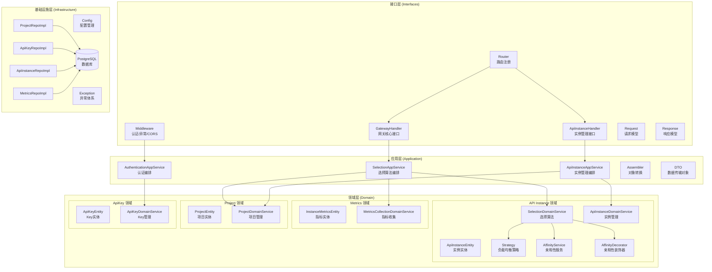
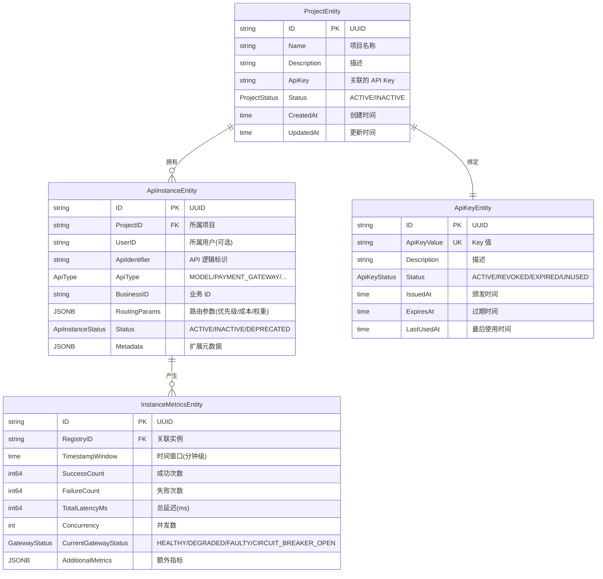
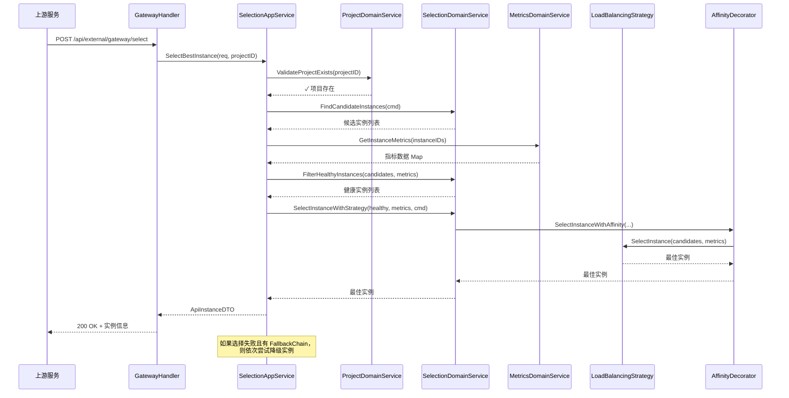
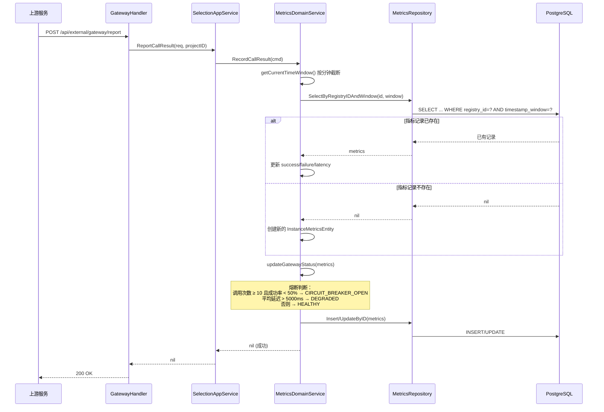
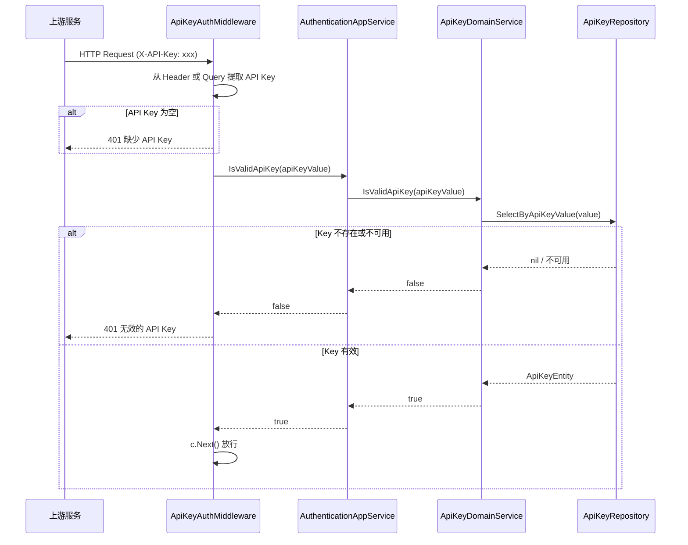
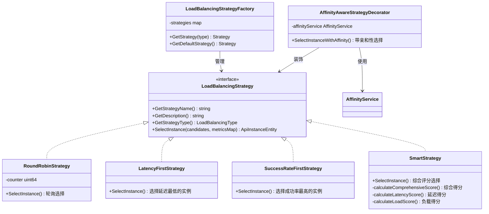
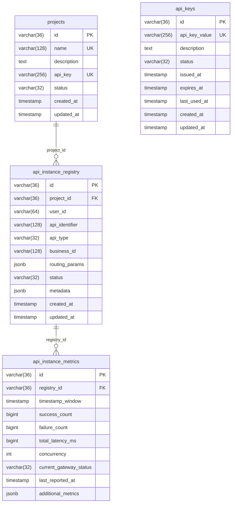

# API Premium Gateway (Go) 架构设计文档

> **项目名称**：API Premium Gateway (Go Edition)  
> **版本**：v1.0.0  
> **文档修订日期**：2026-03-29  
> **架构风格**：DDD（领域驱动设计）四层架构  

---

## 1. 文档概述

### 1.1 项目背景与目标

API Premium Gateway 是一个轻量级的 **API 高可用与智能调度网关**，源自 AgentX 项目对模型调用高可用的需求。它作为上游服务调用各类后端 API（第三方服务、自建微服务、AI 模型等）的**智能中间层**，核心解决以下问题：

- **API 不可用**：某个后端 API 宕机时，自动切换到其他可用实例
- **性能瓶颈**：某个 API 实例响应慢或负载高时，自动选择更优实例
- **多租户管理**：不同项目/用户隔离地使用和管理 API 资源
- **调用可观测性**：实时了解后端 API 的健康状况和性能表现

**注意**：Gateway 不直接代理 API 请求，而是提供**智能决策**能力——告诉上游服务应该调用哪个后端实例。

### 1.2 文档修订记录

| 版本 | 日期 | 修订人 | 修订内容 |
|------|------|--------|----------|
| v1.0.0 | 2026-03-29 | - | 初始版本，Go 语言重写 |

---

## 2. 系统架构总览

### 2.1 架构风格

本项目采用 **DDD（领域驱动设计）经典四层架构**，自上而下分为：

1. **接口层（Interfaces）**：处理 HTTP 请求/响应，路由分发
2. **应用层（Application）**：编排业务流程，事务管理
3. **领域层（Domain）**：核心业务逻辑，策略算法
4. **基础设施层（Infrastructure）**：技术实现，数据持久化

### 2.2 系统架构图



### 2.3 技术栈清单

| 组件 | 技术选型 | 版本 | 说明 |
|------|----------|------|------|
| 语言 | Go | 1.23 | 主要开发语言 |
| Web 框架 | Gin | v1.9.1 | 高性能 HTTP 框架 |
| ORM | GORM | v1.25.5 | Go 语言 ORM 框架 |
| 数据库 | PostgreSQL | 15 | 支持 JSONB 类型 |
| 数据库驱动 | pgx | v5.4.3 | PostgreSQL Go 驱动 |
| 日志 | zerolog | v1.31.0 | 零分配结构化日志 |
| 缓存 | go-cache | v2.1.0 | 本地内存缓存（亲和性绑定） |
| UUID | google/uuid | v1.5.0 | UUID 生成 |
| 配置 | yaml.v3 | v3.0.1 | YAML 配置解析 |
| 容器化 | Docker | - | 多阶段构建 |
| 编排 | Docker Compose | v3.8 | 服务编排 |

---

## 3. 目录结构说明

```
go-gateway/
├── cmd/
│   └── server/
│       └── main.go                          # 应用入口，依赖注入组装
├── configs/
│   └── config.yaml                          # YAML 配置文件
├── docs/                                    # 文档目录
├── internal/                                # 内部包（不对外暴露）
│   ├── interfaces/                          # 接口层
│   │   ├── handler/                         # HTTP Handler
│   │   │   ├── gateway_handler.go           # 网关核心接口（选择/上报）
│   │   │   └── api_instance_handler.go      # API 实例 CRUD 接口
│   │   ├── middleware/
│   │   │   └── middleware.go                # 中间件（认证/异常/CORS）
│   │   ├── request/                         # 请求结构体
│   │   │   ├── gateway_request.go           # 选择/上报请求
│   │   │   └── api_instance/               # 实例管理请求
│   │   ├── response/
│   │   │   └── result.go                    # 统一响应结构
│   │   └── router/
│   │       └── router.go                    # 路由注册
│   ├── application/                         # 应用层
│   │   ├── service/
│   │   │   ├── selection_app_service.go     # 选择算法编排（含降级链）
│   │   │   ├── api_instance_app_service.go  # 实例管理编排
│   │   │   └── authentication_app_service.go # 认证编排
│   │   ├── dto/
│   │   │   └── api_instance_dto.go          # 数据传输对象
│   │   └── assembler/
│   │       └── assembler.go                 # Request ↔ Entity ↔ DTO 转换
│   ├── domain/                              # 领域层（核心）
│   │   ├── apiinstance/                     # API 实例限界上下文
│   │   │   ├── entity/                      # 实体 + 枚举 + 值对象
│   │   │   ├── repository/                  # 仓储接口
│   │   │   ├── command/                     # 命令对象
│   │   │   ├── strategy/                    # 策略模式（4种负载均衡）
│   │   │   └── service/                     # 领域服务（选择/管理/亲和性）
│   │   ├── apikey/                          # API Key 限界上下文
│   │   │   ├── entity/
│   │   │   ├── repository/
│   │   │   └── service/
│   │   ├── metrics/                         # 指标限界上下文
│   │   │   ├── entity/
│   │   │   ├── repository/
│   │   │   ├── command/
│   │   │   └── service/
│   │   └── project/                         # 项目限界上下文
│   │       ├── entity/
│   │       ├── repository/
│   │       └── service/
│   └── infrastructure/                      # 基础设施层
│       ├── config/
│       │   └── config.go                    # 配置加载 + 数据库初始化
│       ├── exception/
│       │   └── errors.go                    # 自定义异常类型体系
│       └── persistence/                     # GORM 仓储实现
│           ├── project_repository_impl.go
│           ├── api_key_repository_impl.go
│           ├── api_instance_repository_impl.go
│           └── metrics_repository_impl.go
├── Dockerfile                               # 多阶段 Docker 构建
├── docker-compose.yml                       # 服务编排
├── Makefile                                 # 构建命令
├── go.mod                                   # Go 模块定义
└── go.sum                                   # 依赖校验
```

---

## 4. 领域模型设计

### 4.1 限界上下文

本项目划分为 **4 个限界上下文（Bounded Context）**：

| 限界上下文 | 核心职责 | 聚合根 |
|-----------|---------|--------|
| **API Instance** | 实例注册、选择算法、负载均衡策略、亲和性路由 | `ApiInstanceEntity` |
| **Metrics** | 性能指标收集、健康状态评估、熔断判断 | `InstanceMetricsEntity` |
| **Project** | 多租户项目管理、项目生命周期 | `ProjectEntity` |
| **ApiKey** | API Key 生成、认证、生命周期管理 | `ApiKeyEntity` |

### 4.2 领域模型关系图



### 4.3 各领域详解

#### 4.3.1 API Instance 领域

**核心实体**：`ApiInstanceEntity` — 代表一个注册到 Gateway 的后端 API 实例

**枚举/值对象**：
- `ApiInstanceStatus`：ACTIVE（激活）、INACTIVE（停用）、DEPRECATED（已弃用）
- `ApiType`：MODEL、PAYMENT_GATEWAY、NOTIFICATION_SERVICE、SMS_SERVICE、EMAIL_SERVICE、FILE_STORAGE、IMAGE_PROCESSING、OTHER
- `LoadBalancingType`：smart、round_robin、success_rate_first、latency_first
- `AffinityStrength`：strict（严格）、preferred（优先）、none（无）
- `AffinityContext`：亲和性上下文值对象
- `AffinityBinding`：亲和性绑定值对象

**仓储接口**：`ApiInstanceRepository` — 提供 CRUD、按业务键查询、候选实例查询、批量操作等

**领域服务**：
- `ApiInstanceDomainService`：实例的 CRUD 管理
- `ApiInstanceSelectionDomainService`：核心选择算法编排
- `AffinityService`：亲和性绑定的缓存管理
- `AffinityAwareStrategyDecorator`：为策略添加亲和性感知能力

#### 4.3.2 Metrics 领域

**核心实体**：`InstanceMetricsEntity` — 记录 API 实例在特定时间窗口内的调用指标

**枚举/值对象**：
- `GatewayStatus`：HEALTHY（健康）、DEGRADED（降级）、FAULTY（故障）、CIRCUIT_BREAKER_OPEN（熔断）
- `JSONBMap`：PostgreSQL JSONB 类型映射（实现 `driver.Valuer` 和 `sql.Scanner`）

**仓储接口**：`MetricsRepository` — 按实例 ID 和时间窗口查询/更新指标

**领域服务**：`MetricsCollectionDomainService` — 记录调用结果、聚合指标、判断熔断/降级状态

#### 4.3.3 Project 领域

**核心实体**：`ProjectEntity` — 多租户隔离的项目单元

**领域服务**：`ProjectDomainService` — 项目 CRUD、API Key 验证、项目存在性校验

#### 4.3.4 ApiKey 领域

**核心实体**：`ApiKeyEntity` — 独立管理的 API Key

**领域服务**：`ApiKeyDomainService` — Key 生成（`gw_` 前缀 + 32 位随机字符）、有效性校验、生命周期管理

---

## 5. 核心业务流程

### 5.1 API 实例选择流程



### 5.2 调用结果上报与指标更新流程



### 5.3 API Key 认证流程



### 5.4 负载均衡策略模式设计



**SmartStrategy 综合评分公式**：

```
综合得分 = 成功率得分 × 0.4 + 延迟得分 × 0.4 + 负载得分 × 0.2

成功率得分 = successRate × 100
延迟得分   = 100 × (2000 / (2000 + avgLatency))
负载得分   = 100 × (100 / (100 + concurrency))
```

冷启动默认值：成功率 = 1.0，延迟 = 1000ms，并发 = 1

---

## 6. 分层架构详解

### 6.1 接口层（Interfaces）

**路由设计**：

| 方法 | 路径 | Handler | 认证 | 说明 |
|------|------|---------|------|------|
| GET | `/api/health` | HealthCheck | ✗ | 健康检查 |
| POST | `/api/external/gateway/select` | SelectInstance | ✓ | 选择最佳实例 |
| POST | `/api/external/gateway/report` | ReportResult | ✓ | 上报调用结果 |
| POST | `/api/external/api-instances/:projectId` | CreateApiInstance | ✓ | 创建实例 |
| POST | `/api/external/api-instances/:projectId/batch` | BatchCreate | ✓ | 批量创建 |
| GET | `/api/external/api-instances/:projectId` | GetByProjectId | ✓ | 获取实例列表 |
| GET | `/api/external/api-instances/detail/:id` | GetById | ✓ | 获取实例详情 |
| PUT | `/api/external/api-instances/:projectId/:apiType/:businessId` | Update | ✓ | 更新实例 |
| DELETE | `/api/external/api-instances/:projectId/:apiType/:businessId` | Delete | ✓ | 删除实例 |
| DELETE | `/api/external/api-instances/:projectId/batch` | BatchDelete | ✓ | 批量删除 |
| PUT | `.../activate` | Activate | ✓ | 激活实例 |
| PUT | `.../deactivate` | Deactivate | ✓ | 停用实例 |
| GET | `/api/admin/api-instances` | GetAllInstances | ✓ | 管理：获取所有实例 |

**中间件链**：`CORS → GlobalExceptionHandler → ApiKeyAuthMiddleware → Handler`

### 6.2 应用层（Application）

- **SelectionAppService**：编排实例选择流程，包含**降级链（Fallback Chain）**机制——当主实例选择失败时，依次尝试 `fallbackChain` 中的备选标识符
- **ApiInstanceAppService**：编排实例 CRUD，调用 `ProjectDomainService` 验证项目存在性
- **AuthenticationAppService**：封装 API Key 认证逻辑
- **Assembler**：负责 Request → Entity → DTO 的双向转换

### 6.3 领域层（Domain）

- **策略模式**：4 种负载均衡策略通过 `LoadBalancingStrategy` 接口统一抽象，由 `LoadBalancingStrategyFactory` 工厂管理
- **装饰器模式**：`AffinityAwareStrategyDecorator` 在策略选择之上叠加亲和性绑定逻辑
- **亲和性绑定**：使用 `go-cache` 本地缓存，默认 60 分钟过期，支持 strict/preferred/none 三种强度
- **熔断机制**：当时间窗口内调用次数 ≥ 10 且成功率 < 50% 时触发熔断

### 6.4 基础设施层（Infrastructure）

- **GORM 仓储实现**：4 个 `*RepositoryImpl` 实现领域层定义的仓储接口
- **配置管理**：YAML 配置文件 + 环境变量覆盖
- **异常体系**：`BusinessError`（业务异常）、`EntityNotFoundError`（实体未找到）、`ParamValidationError`（参数校验）、`ApiKeyError`（Key 相关）

---

## 7. 数据模型

### 7.1 数据库表

| 表名 | 对应实体 | 说明 |
|------|---------|------|
| `projects` | `ProjectEntity` | 项目信息 |
| `api_keys` | `ApiKeyEntity` | API Key 管理 |
| `api_instance_registry` | `ApiInstanceEntity` | API 实例注册表 |
| `api_instance_metrics` | `InstanceMetricsEntity` | 实例调用指标 |

### 7.2 ER 图



---

## 8. 部署架构

### 8.1 Docker 容器化方案

采用**多阶段构建**：
1. **构建阶段**：`golang:1.18-alpine` 编译生成静态二进制文件
2. **运行阶段**：`alpine:3.18` 最小化运行镜像（约 20MB）

### 8.2 环境变量

| 变量名 | 默认值 | 说明 |
|--------|--------|------|
| `CONFIG_PATH` | `configs/config.yaml` | 配置文件路径 |
| `DEFAULT_API_KEY` | `gw_default_key_for_development` | 默认 API Key |

### 8.3 配置文件（config.yaml）

```yaml
server:
  port: 8081
  context_path: /api

database:
  host: localhost
  port: 5432
  user: gateway_user
  password: gateway_pass
  dbname: api_gateway
  sslmode: disable
  max_idle_conns: 5
  max_open_conns: 20
  conn_max_lifetime: 300  # 秒
```

### 8.4 健康检查

- **端点**：`GET /api/health`
- **Docker HEALTHCHECK**：每 30 秒检查一次，超时 5 秒，启动等待 10 秒，最多重试 3 次

---

## 9. 设计决策记录（ADR）

### ADR-001：为什么选择 DDD 分层架构？

**背景**：项目包含复杂的业务逻辑（选择算法、熔断、亲和性），需要清晰的代码组织。

**决策**：采用 DDD 四层架构，将业务逻辑集中在领域层。

**理由**：
- 领域层不依赖任何外层，核心算法可独立测试
- 仓储接口定义在领域层，实现在基础设施层，实现依赖倒置
- 应用层负责编排，避免领域服务之间的直接耦合

### ADR-002：为什么使用策略模式实现负载均衡？

**背景**：需要支持多种负载均衡算法，且未来可能扩展新算法。

**决策**：使用策略模式 + 工厂模式。

**理由**：
- 新增策略只需实现 `LoadBalancingStrategy` 接口并注册到工厂
- 运行时可动态切换策略
- 每种策略的算法逻辑独立封装，符合单一职责原则

### ADR-003：为什么使用装饰器模式实现亲和性？

**背景**：亲和性路由是对负载均衡策略的增强，不应修改策略本身。

**决策**：使用 `AffinityAwareStrategyDecorator` 装饰器。

**理由**：
- 亲和性逻辑与负载均衡策略正交，装饰器模式实现关注点分离
- 可以灵活开启/关闭亲和性功能（当前版本暂时禁用）
- 支持 strict/preferred/none 三种强度，降级逻辑清晰

### ADR-004：为什么使用 go-cache 而非 Redis 做亲和性缓存？

**背景**：亲和性绑定需要快速读写，且数据可以丢失（重新选择即可）。

**决策**：使用 `go-cache` 本地内存缓存。

**理由**：
- 亲和性绑定是临时数据，丢失后可重新建立
- 本地缓存零网络开销，读写延迟极低
- 单实例部署场景下无需分布式缓存
- 减少外部依赖，保持轻量级

---

*文档结束*
